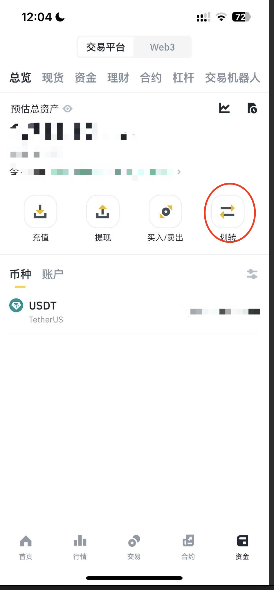

# 资金划转

充值或者购买USDT之后，USDT 一般默认放在资金账户或者现货账户当中

跟单时需要将资金划转到 U本位合约中

1. 点击资金，点击划转按钮

<figure><figcaption></figcaption></figure>

2. 将资金账户或者现货账户的 USDT 划转到 U本位合约账户

<figure><figcaption></figcaption></figure>
